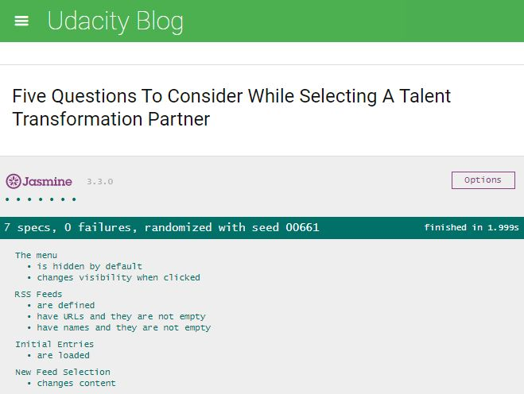

<!-- Title -->
# Testing a feed reader with jasmine 
This is a feed reader application. It uses Google Feed Reader API to grab RSS feeds. The core idea of this project is to add jasmine tests so all the tests pass to ensure that the application is working as we intended it to be.

<!-- Table of contents -->
## Contents

* [Open the feed reader](#Open-the-feed-reader)
* [Testing advantages](#Testing-advantages)
* [Screenshot](#Screenshot)

<!-- How to open  -->
## Open the feed reader

- Get project folder: either download or clone it via: https://github.com/AhlamKhalid/RSS-Feed-Reader.git

- Open the file `index.html`

<!-- Advantages -->
## Testing advantages

jasmine is a framework to test javascript code. When you write tests before even writing the application, they give an introductory idea how to implement the functionalities you need. Once you write a test and actually write the code that pass this test and move on to the next one, you actually build your project step-by-step. This is important to diagnose the code more easily if something went down as we can know which test exactly fails. 

<!-- Screenshot -->
## Screenshot

